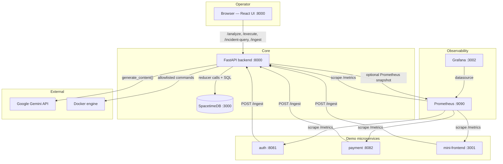
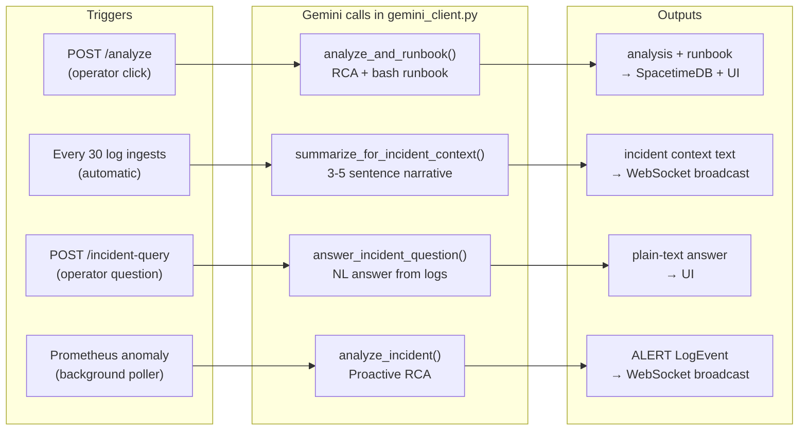
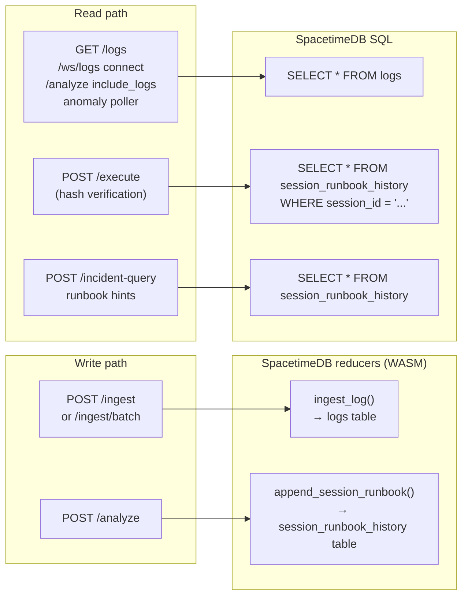

# DevOps AI Platform

> An AI-powered incident response console that turns live logs and telemetry into root-cause analysis, policy-gated runbooks, and safe automated remediation — powered by **Google Gemini**, **SpacetimeDB**, **Prometheus**, and **Docker**.

Built for HackByte 2026 | Stack: React · TypeScript · FastAPI · Python · Google Gemini API · SpacetimeDB · Prometheus · Grafana · Docker

---

## What it does

1. **Ingests live logs** from instrumented microservices (auth, payment, mini-frontend) in real time over HTTP and WebSocket.
2. **Automatically summarizes incidents** — every 30 ingested logs, Gemini writes a 3–5 sentence incident narrative and pushes it to every connected operator.
3. **Analyzes and drafts runbooks on demand** — the operator describes an incident, Gemini produces a root-cause analysis (citing exact log lines, rating severity P1/P2/P3) and a step-by-step bash remediation script.
4. **Enforces safety before execution** — a policy layer blocks dangerous commands (`rm -rf`, `curl | sh`, etc.), produces a sanitized diff, and requires the operator to approve a SHA-256 hash before anything runs.
5. **Executes approved runbooks** via the Docker socket — only allowlisted commands (`docker`, `echo`, `sleep`, `aws`, `systemctl`) actually run.
6. **Answers natural-language questions** over stored logs — "How many payment errors in the last 10 minutes?" is answered by Gemini grounded strictly in the log excerpt.
7. **Detects anomalies proactively** — a background poller watches Prometheus error-rate metrics and fires a pre-emptive Gemini analysis before a human notices.

---

## Architecture



---

## Key Features

| Feature | What it does | Where it lives |
|---------|-------------|----------------|
| **SuperPlane Analysis** | Operator clicks Analyze; Gemini reads logs + metrics + optional screenshot and writes RCA + runbook | `POST /analyze` → `gemini_client.analyze_and_runbook()` |
| **Auto Incident Context** | Every 30 log ingests, Gemini auto-summarizes active incidents and pushes to all operators via WebSocket | `WebSocket /ws/logs` → `gemini_client.summarize_for_incident_context()` |
| **Natural-Language Log Q&A** | Ask "how many payment errors?" in plain English; Gemini answers using only stored log text | `POST /incident-query` → `gemini_client.answer_incident_question()` |
| **Proactive Anomaly Detection** | Background poller checks Prometheus error rate every 30s; auto-triggers Gemini RCA when threshold crossed | `anomaly_poller.py` → `gemini_client.analyze_incident()` |
| **Policy-Gated Execution** | Every Gemini-generated runbook is sanitized (blocked lines shown), hash-approved by operator, then executed | `backend/app/policy.py` + `POST /execute` |
| **Per-Session Runbook History** | Each browser tab has a stable UUID session ID; runbooks are stored per-session so concurrent operators do not overwrite each other | SpacetimeDB `session_runbook_history` table |
| **Multimodal Context** | Operator can attach a Grafana screenshot or architecture diagram; Gemini uses it for visual root-cause analysis | `AnalyzeRequest.image_base64` → `_sync_generate_with_image()` |
| **Graceful Offline Fallback** | All Gemini paths have local heuristic fallbacks; the full stack works without `GEMINI_API_KEY` set | `heuristic_incident_context()`, `fallback_template()`, `incident_query_fallback()` |

---

## Google Gemini Integration

All Gemini calls are in [`backend/app/gemini_client.py`](backend/app/gemini_client.py).  
Authentication: `GEMINI_API_KEY` env var → `google.generativeai.configure(api_key=...)` → `GenerativeModel(GEMINI_MODEL)` (default `gemini-2.0-flash`).

### Call 1 — Incident Analysis + Runbook Generation

**Trigger:** Operator clicks "Analyze" in the UI → `POST /analyze`

**Input contract:**
```
incident_description  string   Free-text incident summary typed by the operator
log_excerpt           string   Last 400 log lines (service [level] message, one per line)
metrics_hint          string   Optional: pasted metrics text or live Prometheus snapshot
image_base64          string   Optional: base64-encoded PNG/JPEG/WebP/GIF screenshot ≤ 5 MB
image_mime_type       string   Optional: MIME type of the image (default image/png)
```

**Prompt intent:** Gemini is asked to act as a "world-class Senior SRE at a Fortune 500 company" and must:
- Identify exact failing log lines
- Trace the failure cascade (what broke first → what broke next)
- Identify root cause (OOM? DB down? 502 gateway? crash loop?)
- Rate severity: P1 / P2 / P3
- Generate a specific bash runbook using only allowlisted commands (`docker`, `echo`, `sleep`, `aws`, `systemctl`)

**Output contract:**
```
analysis        string                 Technical root-cause paragraph with log citations and severity rating
raw_runbook     string                 Bash script block extracted from Gemini response
preview         PolicyPreviewResponse  original_lines, sanitized_lines, blocked[] (line, reason)
approved_hash   string                 SHA-256 of sanitized_lines — required to call /execute
```

**What happens next:** The sanitized runbook + hash are stored in SpacetimeDB `session_runbook_history` for the operator's session. Execution is only allowed if the submitted hash matches.

**Fallback (no `GEMINI_API_KEY`):** `fallback_template()` pattern-matches logs for known signals (502, OOM/exit-137, DB connection refused, EC2/systemd) and generates a contextual heuristic runbook — never a generic "restart everything".

---

### Call 2 — Live Incident Context Summarization

**Trigger:** Automatically, every `INCIDENT_CONTEXT_EVERY_N` ingested logs (default **30**), enforced with a minimum `INCIDENT_CONTEXT_MIN_INTERVAL_S` cooldown (default **45 s**) to control API cost.

**Input contract:**
```
compressed_logs   string   Last INCIDENT_CONTEXT_MAX_LINES (default 45) log lines,
                           each formatted as time|service|LEVEL|message,
                           messages truncated to INCIDENT_CONTEXT_MAX_MSG_LEN (default 140 chars)
```

**Prompt intent:** Gemini is asked to act as an "on-call SRE" and write a 3–5 sentence incident description for the "Incident Context" text box. Rules: name specific services and failure types seen, no runbook, no markdown, plain text only.

**Output contract:**
```
text   string   Plain-text incident narrative pushed to all connected WebSocket clients
                as {"type": "incident_context", "text": "..."}
                The React UI replaces the Incident Context textarea unless operator
                has checked "Pause auto context".
```

**Fallback:** `heuristic_incident_context()` counts ERROR/WARN lines, identifies themes (timeout, 502, OOM, circuit breaker, connection pool) from keyword scanning, and returns a structured summary without calling the API.

---

### Call 3 — Natural-Language Log Q&A

**Trigger:** Operator types a question in the SuperPlane Sandbox → `POST /incident-query`

**Input contract:**
```
question              string   Plain-English question (e.g. "How many payment errors in recent logs?")
log_excerpt           string   Last log_limit lines (default 600, capped by LOG_BUFFER_MAX),
                               truncated to INCIDENT_QUERY_MAX_LOG_CHARS (default 120 000 chars)
runbook_excerpt       string   Optional: recent sanitized runbook rows from SpacetimeDB
                               (truncated, no timestamps — Gemini is told not to infer MTTR from these)
```

**Prompt intent:** Gemini must answer **only** from the provided log excerpt. Rules enforced in the prompt:
- Quote or paraphrase log lines as evidence
- If the question needs data not in the excerpt (e.g. exact MTTR, time ranges without timestamps), say so explicitly
- Never invent incident counts or timelines

**Output contract:**
```
answer   string   Plain-text natural-language answer grounded in the log excerpt
```

**Fallback:** `incident_query_fallback()` returns a heuristic count of ERROR/FATAL lines, payment-service mentions, and crash-signal lines, plus a note that `GEMINI_API_KEY` is not set.

---

### Call 4 — Proactive Anomaly Auto-Analysis

**Trigger:** `anomaly_poller.py` runs a background loop every `ANOMALY_POLL_INTERVAL_SEC` (default **30 s**):
- Queries Prometheus: `sum(rate(http_requests_total{status=~"5.."}[2m])) / sum(rate(http_requests_total[2m]))`
- If error rate exceeds `ANOMALY_ERROR_THRESHOLD` (default 3%), or with ~15% random probability in simulation mode (`SIMULATE_ANOMALIES=true`)

**Input contract:**
```
incident_description   string   Auto-generated: "Payment Service error rate detected at X%, exceeding Y% threshold"
logs_text              string   Last 80 log lines
metrics_hint           string   Live Prometheus snapshot text (error rate, request counts)
```

**Prompt intent:** Same SRE prompt as Call 1 — full RCA + runbook for the detected anomaly.

**Output contract:** Result is broadcast as a `LogEvent` via WebSocket:
```
service   "SuperPlane_AI"
level     "ALERT"
message   "PRE-EMPTIVE RUNBOOK MAPPED:\n\nRoot Cause: <analysis>\n\nSuggested Fix:\n<runbook>"
```

**Cooldown:** After firing, the poller waits 6 × 30 s = **3 minutes** before triggering again.

---

### Gemini Call Flow Summary



---

## SpacetimeDB Integration

### Video demo (walkthrough)

**[SpacetimeDB demo — screen recording (Google Drive)](https://drive.google.com/file/d/16INH19_dP60RCWupUjsVinywG751nbgi/view?usp=sharing)** — visual walkthrough of how SpacetimeDB is used in this project alongside the rest of the stack. Watch this first for the high-level story; the subsections below are the full technical detail. Deeper operational notes are in **[docs/SPACETIMEDB.md](docs/SPACETIMEDB.md)**.

### Where SpacetimeDB is used (and why it matters)

In this platform, **SpacetimeDB is the single system of record** for what operators and the AI must rely on after the fact: **live telemetry** and **audit-grade runbook history**. It is not a disposable cache—it is the durable spine between microservices, the FastAPI control plane, and the React console.

| Concern | Without a purpose-built store | What SpacetimeDB gives us here |
|--------|------------------------------|--------------------------------|
| **Log continuity** | In-memory buffers vanish on restart; log files are awkward to query uniformly | **`logs`** table: append-only rows with server-side trim (2000 lines), so Gemini, `/analyze`, WebSocket replay, and anomaly detection all read **one coherent tail** |
| **Multi-operator safety** | A single shared runbook file overwrites the last incident | **`session_runbook_history`**: append-only rows (PK `id`), scoped by **`X-Session-Id`**, so concurrent incident commanders do not clobber each other’s approved hashes |
| **Operational surface area** | Another RDBMS + migrations + pool tuning | **One container**, **Rust → WASM module**, **HTTP reducers + SQL**—[`persistence.py`](backend/app/persistence.py) stays a thin `httpx` client |

Every `POST /ingest` from the demo services becomes an **`ingest_log`** reducer call: the database **owns** ordering and retention. Every successful analysis persists the sanitized script and SHA-256 via **`append_session_runbook`**, so **`/execute` is not “whatever the UI remembers”—it is “what was written and hashed in SpacetimeDB for this session.” That separation—**Gemini reasons**, **Docker acts**, **SpacetimeDB remembers**—is what makes the demo narratable as architecture, not as a glued-on chatbot.

### How SpacetimeDB is used end-to-end (detailed)

1. **Ingest** — Demo services (or replay scripts) `POST /ingest` to FastAPI. The backend calls **`ingest_log`** on SpacetimeDB, which inserts into **`logs`** and trims beyond 2000 rows inside the WASM module.
2. **Live UI** — On WebSocket connect, clients receive a tail of rows read from **`logs`** via SQL; new lines broadcast after each ingest still ultimately **persist in SpacetimeDB** first (so reconnects and `/logs` stay consistent).
3. **Analyze** — `POST /analyze` loads a **log tail** from SpacetimeDB (not from an ephemeral Python list alone), sends it to Gemini, then stores the **sanitized runbook + hash** with **`append_session_runbook`** in **`session_runbook_history`** for the caller’s **`X-Session-Id`**.
4. **Execute** — `POST /execute` loads the **latest row** for that session from **`session_runbook_history`** and checks the hash **against what is stored** before running Docker. No hash match → no execution.
5. **Ask logs** — `POST /incident-query` can attach recent **`logs`** text and optional **truncated runbook rows** from **`session_runbook_history`** so answers stay grounded in what the database actually holds.

SpacetimeDB provides persistent, real-time storage for log events and per-session runbook history.  
The module is written in **Rust** and compiled to **WASM**: [`spacetimedb/devops-module/src/lib.rs`](spacetimedb/devops-module/src/lib.rs).  
The FastAPI backend talks to it over **HTTP** (`/v1/database/{name}/call/...` for writes, `/v1/database/{name}/sql` for reads).  
Python client: [`backend/app/persistence.py`](backend/app/persistence.py).

### Tables

#### `logs`

Stores every ingested log event. Capped at **2000 rows** (oldest deleted automatically on overflow).

```
Column      Type     Notes
id          u64      Auto-increment primary key (used for ordering)
time        String   ISO-8601 timestamp (set by ingest caller)
service     String   Service name (e.g. "payment", "auth", "SuperPlane_AI")
level       String   "INFO", "WARN", "ERROR", "CRITICAL", "ALERT"
message     String   Log message text
extra_json  String   JSON-serialised extra fields, or "{}"
```

#### `session_runbook_history`

Stores policy-sanitized runbooks per operator session. **Append-only** — no row is ever updated or deleted.

```
Column               Type     Notes
id                   u64      Auto-increment primary key (used to find "latest" for a session)
session_id           String   UUID — sent by browser as X-Session-Id header (stable per tab)
last_sanitized       String   Full policy-cleaned bash script text
last_sanitized_hash  String   SHA-256 hex of last_sanitized — must match to allow /execute
```

### Reducers (Write Path)

Reducers are Rust functions compiled into the WASM module and called via the SpacetimeDB HTTP API.

#### `ingest_log`

```
Endpoint:  POST /v1/database/{name}/call/ingest_log
Body:      JSON array — [time, service, level, message, extra_json]
Called by: persistence.append_log_event() on every POST /ingest or /ingest/batch
Effect:    Inserts one LogRow; trims oldest rows if table exceeds LOG_BUFFER_MAX (2000)
```

#### `append_session_runbook`

```
Endpoint:  POST /v1/database/{name}/call/append_session_runbook
Body:      JSON array — [session_id, last_sanitized, last_sanitized_hash]
Called by: persistence.append_session_runbook() after every successful POST /analyze
Effect:    Inserts one SessionRunbookHistory row (never updates existing rows)
```

### SQL Reads

SpacetimeDB accepts raw SQL over `POST /v1/database/{name}/sql` with `Content-Type: text/plain`.

#### `fetch_log_tail(limit)`

```sql
SELECT * FROM logs
```
Python sorts by `id` (ascending), takes the last `limit` rows. Used by:
- `GET /logs` — returns log history to the UI
- `WebSocket /ws/logs` — sends last 200 events on connect
- `POST /analyze` (when `include_logs=true`) — feeds last 400 lines to Gemini
- `anomaly_poller.py` — feeds last 80 lines to proactive Gemini call

#### `get_session_runbook(session_id)`

```sql
SELECT * FROM session_runbook_history WHERE session_id = '<uuid>'
-- falls back to SELECT * if ORDER BY / LIMIT is not supported
```
Returns the row with the **highest `id`** for that session (latest runbook). Used by:
- `POST /execute` — verifies submitted hash matches the approved runbook before running any commands

#### `fetch_recent_runbook_summaries(limit)`

```sql
SELECT * FROM session_runbook_history
```
Returns the last `limit` rows (sorted by id), with each script truncated to 400 chars. Used by:
- `POST /incident-query` (when `include_runbook_hints=true`) — appended to Gemini's context so it can reference past remediation steps when answering questions

### Why SpacetimeDB (the short pitch)

- **WASM-native module** — business rules (trim logs, insert runbooks) live in **Rust compiled to WASM** and run **inside** the database runtime, not in ad hoc Python cron jobs. That keeps hot paths predictable and auditable.
- **Per-session isolation** — concurrent operators (different `X-Session-Id` values) each have their own **append-only** runbook history; no “last writer wins” in a shared row.
- **Minimal moving parts** — one SpacetimeDB service in Compose, one published module name (`SPACETIME_DATABASE`), **no** SQLAlchemy migrations or second network hop to Postgres for this use case.
- **Survives chaos** — restart the **backend** container: logs and runbook rows are still there; reconnect the UI and `/execute` still validates against stored hashes.
- **Fits the AI loop** — tail queries feed Gemini and incident-query; reducers keep writes **fast and structured** so you are not dumping opaque blobs into a document store and hoping for the best.

### SpacetimeDB Data Flow



---

## Prerequisites

| Tool | Purpose |
|------|---------|
| **Docker Engine** + **Docker Compose v2** | Run the full stack |
| **Node.js 20+** and **npm** | Build the React console (`web/`) |
| **Python 3.12+** with `pip` | Backend unit tests (optional, local) |
| **bash**, **curl** | E2E script `scripts/verify-stack.sh` (Git Bash or WSL on Windows) |

- **Compose file path:** the stack is defined in **`infra/docker-compose.yml`**. Raw `docker compose` commands must use **`-f infra/docker-compose.yml`** (or **`npm run stack:*`**, which sets it for you).
- **Google AI Studio API key** for Gemini — optional; the backend uses fallback templates when it is not set.

---

## Quick Start

Always run commands from the **repository root**. The Compose file is **`infra/docker-compose.yml`**, not in the root folder.

### Linux / macOS / Git Bash / WSL

```bash
# 1) Copy environment and optionally set GEMINI_API_KEY
cp .env.example .env

# 2) Build the React UI (must run before Docker build — embeds web/dist into the backend image)
npm run build:web

# 3) Start the full stack (foreground — Ctrl+C stops everything)
npm run stack:up
```

Run in background instead:

```bash
npm run stack:up:detached
```

### Windows PowerShell

```powershell
cd "E:\hackbyte 1"
Copy-Item .env.example .env
npm run build:web
npm run stack:up:detached
```

Manual Docker Compose (if you prefer not to use npm scripts):

```powershell
docker compose --profile local-spacetime -f infra/docker-compose.yml --env-file .env up -d --build
```

**Open the app:** [http://localhost:8000/](http://localhost:8000/)

**Stop the stack:**

```bash
npm run stack:down
```

---

## Run the Application (Step by Step)

Do this from the **repository root** unless a path is given.

### 1. Environment file

```bash
cp .env.example .env
```

- Set **`GEMINI_API_KEY`** in `.env` for live Gemini responses ([Google AI Studio](https://aistudio.google.com/apikey)). Without it, all Gemini paths use local heuristic fallbacks — the app still works fully.
- **`SPACETIME_DATABASE`** must match the module publish name (default `devopsai`).
- With Docker Compose, `SPACETIME_HTTP_URL` is already set to `http://spacetime:3000` inside the container; do not override it in `.env` for Compose.
- Host tools talking to SpacetimeDB use `http://localhost:3004` (Compose maps host 3004 → container 3000).

### 2. Build the web console

```bash
npm run build:web
```

The backend Docker image embeds `web/dist`, so you must build the UI before building or starting the stack.

### 3. Start the stack

**Local SpacetimeDB (default):**

```bash
npm run stack:up           # foreground
npm run stack:up:detached  # background
```

**SpacetimeDB Maincloud:** set `SPACETIME_HTTP_URL` and `SPACETIME_BEARER_TOKEN` in `.env` (see [docs/SPACETIMEDB.md](docs/SPACETIMEDB.md)), then:

```bash
npm run stack:up:maincloud
```

### 3b. Rebuild demo microservices after code changes

```bash
docker compose --profile local-spacetime -f infra/docker-compose.yml --env-file .env build auth-service payment-service frontend-service
docker compose --profile local-spacetime -f infra/docker-compose.yml --env-file .env up -d --force-recreate auth-service payment-service frontend-service
```

### 4. What to expect on first start

1. **SpacetimeDB** starts and passes its healthcheck.
2. **`st-init`** runs `spacetime publish` for the Rust WASM module. The **first** run can take **several minutes** (Rust → WASM compile). Later starts are faster if build caches exist.
3. **`backend`** starts after `st-init` completes.
4. Other services (auth, payment, frontend, Prometheus, Grafana) come up per `infra/docker-compose.yml`.

### 5. URLs after services are healthy

| Service | URL | Notes |
|---------|-----|-------|
| **Console UI** | http://localhost:8000/ | Main demo |
| **Backend health** | http://localhost:8000/health | JSON health |
| **SpacetimeDB** | http://localhost:3004/v1/ping | Should return 200 |
| **Grafana** | http://localhost:3002/ | admin / admin |
| **Prometheus** | http://localhost:9090/ | Metrics UI |
| **Mini frontend** | http://localhost:3001/ | Generates traffic |
| **Auth API** | http://localhost:8081/health | |
| **Payment API** | http://localhost:8082/health | |

---

## Verify Everything Works

### A. Quick HTTP checks

```bash
curl -sf http://localhost:8000/health
curl -sf http://localhost:3004/v1/ping
curl -sf "http://localhost:9090/api/v1/query?query=up"
curl -sf http://localhost:8081/health
curl -sf http://localhost:8082/health
```

### B. Manual UI walkthrough

1. Open **http://localhost:8000/**.
2. Open **http://localhost:3001/** and use Login / Pay to generate traffic.
3. Enter an incident description and click **Analyze + runbook**.
4. Optionally enable **Attach live Prometheus snapshot** — the backend fetches instant queries from Prometheus and merges them into the Gemini prompt.
5. Optionally attach a **screenshot or diagram** (PNG/JPEG/WebP/GIF, max 5 MB) — Gemini uses it as multimodal visual context.
6. Review blocked/sanitized lines in the policy preview, then click **Execute approved runbook**.

**Demo replay scripts:**

```bash
# Full multi-phase incident arc (healthy → degradation → cascade → recovery)
python scripts/demo-replay.py --scenario full --speed 5

# Short sample replay
bash scripts/replay-sample-logs.sh
```

Scenarios: `healthy`, `degradation`, `cascade`, `recovery`, `full`. Use `--speed 0` to send all at once.

### C. Automated tests

```bash
# Backend unit tests (no Docker required)
cd backend
pip install -r requirements.txt -r requirements-dev.txt
cd ..
npm run test:unit

# Full-stack E2E (requires running Compose stack)
npm run test:e2e
```

The E2E script waits up to 600 s for `/health`. If the first Spacetime publish is still compiling:

```bash
WAIT_SECS=1200 npm run test:e2e
```

---

## API Reference

| Endpoint | Method | Description |
|----------|--------|-------------|
| `/ingest` | POST | Ingest one log event: `{ service, level, message, time? }` |
| `/ingest/batch` | POST | Ingest multiple: `{ events: [LogEvent, ...] }` |
| `/analyze` | POST | Trigger Gemini RCA + runbook. Body: `AnalyzeRequest`. Header: `X-Session-Id` (UUID) |
| `/execute` | POST | Execute approved runbook: `{ content, content_hash }`. Same `X-Session-Id` as analyze |
| `/incident-query` | POST | NL question over logs: `{ question, log_limit?, include_runbook_hints? }` |
| `/logs` | GET | Recent log history (from SpacetimeDB) |
| `/health` | GET | Backend health JSON |
| `/metrics` | GET | Prometheus metrics for this backend |
| `ws://…/ws/logs` | WS | Real-time log stream + auto incident context pushes |

**`X-Session-Id` header:** A UUID stored in `localStorage` per browser tab. Keeps concurrent operators isolated in SpacetimeDB — each has their own runbook history and approved hash.

**WebSocket message shapes:**
```json
// Log line (most messages)
{ "time": "...", "service": "...", "level": "INFO", "message": "..." }

// Auto incident context (every N ingests)
{ "type": "incident_context", "text": "3-5 sentence Gemini narrative..." }
```

**Example — natural-language query:**

```bash
curl -sf -X POST http://localhost:8000/incident-query \
  -H "Content-Type: application/json" \
  -d '{"question":"How many ERROR lines mention payment in recent logs?","log_limit":400}'
```

---

## Project Layout

```
spacetimedb/devops-module/   Rust SpacetimeDB module (WASM) — tables + reducers
services/                    auth, payment, mini-frontend microservices (Node.js + Prometheus metrics)
backend/
  app/
    main.py                  FastAPI routes, WebSocket, anomaly poller startup
    gemini_client.py         All 4 Gemini call sites + fallback implementations
    persistence.py           SpacetimeDB HTTP client — reducer calls + SQL reads
    policy.py                Command allowlist, sanitizer, SHA-256 hasher
    executor.py              Runs approved runbook steps via Docker socket
    anomaly_poller.py        Background Prometheus watcher + auto Gemini trigger
    models.py                Pydantic models (LogEvent, AnalyzeRequest, GeminiAnalysisResponse, ...)
    prometheus_snapshot.py   Instant-query builder for Prometheus metric hints
infra/
  docker-compose.yml         Full stack definition (backend, spacetime, st-init, services, Prometheus, Grafana)
  grafana/                   Grafana provisioning (datasource, dashboards)
  terraform/ec2-docker/      Optional AWS EC2 + Docker bootstrap (Terraform)
web/                         React console (Vite + TypeScript)
scripts/
  verify-stack.sh            Full-stack E2E health check
  demo-replay.py             Replay realistic-demo.jsonl scenarios
  fault-inject.sh            Optional failure injection
  replay-sample-logs.sh      Short sample log replay
samples/
  realistic-demo.jsonl       Full demo arc (healthy → cascade → recovery)
  incident-sample.jsonl      Short replay sample
package.json                 Root npm scripts: build:web, stack:up, stack:down, test:unit, test:e2e
```

---

## Cloud VM (e.g. AWS EC2)

1. **Instance:** Ubuntu 22.04+, open inbound 22 (SSH), 8000 (UI/API), 3002 (Grafana, optional), 3004 (SpacetimeDB, optional), 9090 (Prometheus, optional), 8081–8082, 3001 as needed.
2. Install Docker: [Docker Engine install for Ubuntu](https://docs.docker.com/engine/install/ubuntu/).
3. Clone the repo, copy `.env.example` to `.env`, set `GEMINI_API_KEY`.
4. Install Node 20 (e.g. nvm) and run `npm run build:web`.
5. Run `npm run stack:up:detached`.
6. Open `http://<PUBLIC_IP>:8000/` for the console.

**Security:** Do not expose the Docker socket publicly. The backend container mounts `/var/run/docker.sock` only on the trusted host.

---

## Development (Vite Dev Server)

```bash
cd web && npm ci && npm run dev
```

Vite defaults to port **5173** (or 5174 if taken) and proxies all API and WebSocket paths to FastAPI on **8000**. Add your Vite origin to `CORS_ORIGINS` in `.env` (see `.env.example`).

**Backend without Docker:**

```bash
# 1. Start local SpacetimeDB
spacetime start

# 2. Publish the Rust module
cd spacetimedb/devops-module && spacetime publish devopsai && cd ../..

# 3. Configure and start the backend
export SPACETIME_HTTP_URL=http://127.0.0.1:3000
export SPACETIME_DATABASE=devopsai
cd backend && pip install -r requirements.txt
uvicorn app.main:app --reload --host 0.0.0.0 --port 8000
```

---

## CI

[`.github/workflows/ci.yml`](.github/workflows/ci.yml) runs on push/PR to `main` / `master`:

- Builds `web/`, runs `pytest` in `backend/`, runs a policy import smoke check
- Builds all Compose images
- In a separate job: starts the full Compose stack and runs `scripts/verify-stack.sh` (with `WAIT_SECS=1200`)

Optional: add a repository secret `GEMINI_API_KEY` so CI's running backend can call Gemini during the E2E job.

---

## Documentation

- **SpacetimeDB setup and troubleshooting:** [docs/SPACETIMEDB.md](docs/SPACETIMEDB.md)
- **PDF vs implementation mapping:** [docs/PDF_VS_IMPLEMENTATION.md](docs/PDF_VS_IMPLEMENTATION.md)
- **Live telemetry / agent demo site:** [docs/AGENT_DEMO_WEBSITE.md](docs/AGENT_DEMO_WEBSITE.md)
- **Terraform EC2 bootstrap:** [infra/terraform/ec2-docker/README.md](infra/terraform/ec2-docker/README.md)
