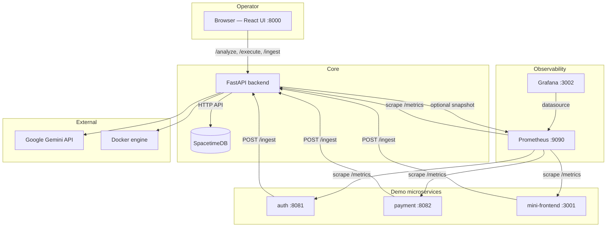

# DevOps AI Platform

AI-augmented DevOps demo: three instrumented services, Prometheus + Grafana, FastAPI backend with Gemini (Google AI Studio) for incident analysis and runbook drafts, policy filtering (VeriGuard-style), and safe `docker` execution.

The stack includes **SpacetimeDB** (standalone in Docker) for persisted log events and **per-session** runbook history (each analyze/approve inserts a row; the backend reads the **latest** row per session for approve/execute). The Rust module in [`spacetimedb/devops-module/`](spacetimedb/devops-module/) defines public tables **`logs`** and **`session_runbook_history`**, plus reducers `ingest_log` and `append_session_runbook`. The FastAPI app talks to SpacetimeDB over its **HTTP API** (`/v1/database/.../call/...` and `/sql`). The web UI sends a stable **`X-Session-Id`** (stored in `localStorage`) on analyze/execute so concurrent operators do not overwrite each other’s runbooks. API clients may omit the header to use the default session id `00000000-0000-0000-0000-000000000001`.

**SpacetimeDB (architecture and troubleshooting):** [docs/SPACETIMEDB.md](docs/SPACETIMEDB.md)

## High-level architecture

The **operator** uses the **React** console (static assets embedded in and served by the **FastAPI** backend on port **8000**). The backend is the control plane: it **ingests logs** from the demo microservices (**auth**, **payment**, **mini-frontend**), persists them and **per-session runbook history** in **SpacetimeDB** over its **HTTP API**, optionally pulls **Prometheus** instant queries for richer **Gemini** prompts, applies **policy** checks, and runs **allowlisted** commands via the **Docker** socket on the host. **Prometheus** scrapes metrics from the backend and demo services; **Grafana** visualizes metrics using Prometheus as a datasource. **Google Gemini** is called over the internet when `GEMINI_API_KEY` is set.



**Build your own demo site (real logs → Live Telemetry):** [docs/AGENT_DEMO_WEBSITE.md](docs/AGENT_DEMO_WEBSITE.md) describes the `LogEvent` contract, `LOG_INGEST_URL`, optional `INGEST_SECRET`, and points to the reference implementations under `services/`.

---

## Prerequisites

| Tool | Purpose |
|------|---------|
| **Docker Engine** + **Docker Compose v2** | Run the full stack |
| **Node.js 20+** and **npm** | Build the React console (`web/`) |
| **Python 3.12+** with `pip` | Backend unit tests (optional, local) |
| **bash**, **curl** | E2E script `scripts/verify-stack.sh` (Git Bash or WSL on Windows) |

- **Compose file path:** the stack is defined in **`infra/docker-compose.yml`**. Raw `docker compose` commands must use **`-f infra/docker-compose.yml`** (or **`npm run stack:*`**, which sets it for you).
- **Google AI Studio API key** for Gemini — optional; the backend uses fallback templates when it is not set.

---

## Quick start — commands to run the program

Always run commands from the **repository root** (`E:\hackbyte 1` or your clone). The Compose file is **`infra/docker-compose.yml`**, not in the root folder.

**Recommended:** use the **npm scripts** below — they already pass `-f infra/docker-compose.yml` and `--env-file .env`, so you do not need to remember paths.

### Linux, macOS, Git Bash, or WSL

```bash
# 1) Environment (copy example and optionally edit GEMINI_API_KEY, etc.)
cp .env.example .env

# 2) Build the web UI (required before Docker build — embeds web/dist in the backend image)
npm run build:web

# 3) Start the full stack with local SpacetimeDB (foreground — Ctrl+C stops everything)
npm run stack:up
```

**Run in the background** instead of step 3:

```bash
npm run stack:up:detached
```

### Windows PowerShell

Same steps; use `Copy-Item` if you prefer not to use `cp`:

```powershell
cd "E:\hackbyte 1"   # use your actual clone path
Copy-Item .env.example .env
npm run build:web
npm run stack:up:detached
```

If you run **`docker compose` by hand** (not via `npm run`), you **must** point at the compose file or Docker prints `no configuration file provided`:

```powershell
docker compose --profile local-spacetime -f infra/docker-compose.yml --env-file .env up -d --build
docker compose -f infra/docker-compose.yml logs frontend-service --tail 20
docker compose -f infra/docker-compose.yml --env-file .env down
```

Optional one-liner for a session: `$env:COMPOSE_FILE = "infra/docker-compose.yml"` (still use `--profile local-spacetime` when starting the full local stack).

**Then open the app:** [http://localhost:8000/](http://localhost:8000/) (main console). In the **SuperPlane Sandbox** tab, use **Ask your logs (natural language)** to query recent stored logs in plain English (`POST /incident-query`; set `GEMINI_API_KEY` for full answers).

**Stop the stack** (if you used detached mode): `npm run stack:down` (same on bash or PowerShell from the repo root).

**Optional checks** (with the stack running, second terminal):

```bash
curl -sf http://localhost:8000/health
```

For SpacetimeDB **Maincloud** instead of local Docker SpacetimeDB, configure `SPACETIME_HTTP_URL` and `SPACETIME_BEARER_TOKEN` in `.env` per [docs/SPACETIMEDB.md](docs/SPACETIMEDB.md), build the web as above, then:

```bash
npm run stack:up:maincloud
```

Details, URLs for all services, and troubleshooting: see **Run the application (step by step)** below.

---

## Run the application (step by step)

Do this from the **repository root** unless a path is given.

### 1. Environment file

Copy the example env and edit values as needed:

```bash
cp .env.example .env
```

- Set **`GEMINI_API_KEY`** in `.env` if you want live Gemini responses ([Google AI Studio](https://aistudio.google.com/apikey)).
- **`SPACETIME_DATABASE`** must match the name used when publishing the module (default `devopsai`).
- With **Docker Compose**, the backend container already uses **`SPACETIME_HTTP_URL=http://spacetime:3000`** on the internal network (see `infra/docker-compose.yml`). You normally **do not** set `SPACETIME_HTTP_URL` in `.env` for Compose.
- For tools on the **host** talking to SpacetimeDB’s published port, use **`http://localhost:3004`** (Compose maps host `3004` → container `3000`).

### 2. Build the web console

The backend Docker image **embeds** `web/dist`, so you must build the UI **before** building or starting the stack:

```bash
npm run build:web
```

Equivalent manual commands:

```bash
cd web && npm ci && npm run build && cd ..
```

If `npm run build:web` fails, install Node 20+ and retry.

### 3. Start the stack

**Embedded local SpacetimeDB** (default `npm` scripts — publishes the Rust module inside Docker):

**Foreground** (logs in the terminal; Ctrl+C stops the stack):

```bash
npm run stack:up
```

**Detached** (containers run in the background):

```bash
npm run stack:up:detached
```

Equivalent manual command:

```bash
docker compose --profile local-spacetime -f infra/docker-compose.yml --env-file .env up --build
```

Add `-d` for detached mode.

**SpacetimeDB Maincloud** instead of local containers: set `SPACETIME_HTTP_URL` and `SPACETIME_BEARER_TOKEN` in `.env` (see [docs/SPACETIMEDB.md](docs/SPACETIMEDB.md)), then start **without** the `local-spacetime` profile:

```bash
npm run stack:up:maincloud
```

### 3b. Rebuild demo microservices (auth, payment, frontend)

The Node services under `services/` are **baked into Docker images** at build time. After you change their code, **rebuild and recreate** those containers or the UI will keep showing old log text (e.g. `simulated login`).

From the **repository root**:

```bash
docker compose --profile local-spacetime -f infra/docker-compose.yml --env-file .env build auth-service payment-service frontend-service
docker compose --profile local-spacetime -f infra/docker-compose.yml --env-file .env up -d --force-recreate auth-service payment-service frontend-service
```

**Windows PowerShell** (same paths):

```powershell
docker compose --profile local-spacetime -f infra/docker-compose.yml --env-file .env build auth-service payment-service frontend-service
docker compose --profile local-spacetime -f infra/docker-compose.yml --env-file .env up -d --force-recreate auth-service payment-service frontend-service
```

If you use **Maincloud** (no `local-spacetime` profile), omit `--profile local-spacetime` on both lines.

### 4. What to expect on first start

**If using embedded local SpacetimeDB** (`--profile local-spacetime`):

1. **SpacetimeDB** starts and passes its healthcheck.
2. **`st-init`** runs once: `spacetime publish` for `spacetimedb/devops-module`. The **first** run can take **several minutes** (Rust → WASM compile). Later starts are faster if build caches exist.
3. **`backend`** starts after **`st-init`** completes (when those services are enabled).

**If using Maincloud**, there is no local `spacetime` / `st-init`; the backend connects to `https://maincloud.spacetimedb.com` — publish the module to Maincloud first.

4. Other services (auth, payment, frontend, Prometheus, Grafana) come up per `infra/docker-compose.yml`.

If the backend seems slow to listen, wait; the E2E script can wait up to **600s** by default (override with `WAIT_SECS`).

### 5. URLs after services are healthy

| Service | URL | Notes |
|---------|-----|--------|
| **Console UI** (React, served by backend) | http://localhost:8000/ | Main demo |
| **Backend health** | http://localhost:8000/health | JSON health |
| **SpacetimeDB** (host) | http://localhost:3004/v1/ping | Should return 200 |
| **Grafana** | http://localhost:3002/ | admin / admin (host port from Compose) |
| **Prometheus** | http://localhost:9090/ | Metrics UI |
| **Mini frontend app** | http://localhost:3001/ | Generates traffic |
| **Auth API** | http://localhost:8081/health | |
| **Payment API** | http://localhost:8082/health | |

---

## Verify that everything works

### A. Quick HTTP checks (host)

Run these in a second terminal while the stack is up:

```bash
curl -sf http://localhost:8000/health
curl -sf http://localhost:3004/v1/ping
curl -sf "http://localhost:9090/api/v1/query?query=up"
curl -sf http://localhost:8081/health
curl -sf http://localhost:8082/health
```

You should get **HTTP 200** responses (Prometheus returns JSON with `"status":"success"` for the query).

### B. Manual UI check

1. Open **http://localhost:8000/**.
2. Optionally open **http://localhost:3001/** and use Login / Pay to generate traffic (or use the `curl` health calls above).
3. In the console, enter an incident description and click **Analyze + runbook**.
4. Optionally enable **Attach live Prometheus snapshot** so the backend fetches instant queries from Prometheus (`PROMETHEUS_URL`, default `http://prometheus:9090` in Compose) and merges them into the metrics context for Gemini.
5. Optionally attach a **screenshot or diagram** (PNG/JPEG/WebP/GIF, max 5MB) — the model uses it as multimodal context when `GEMINI_API_KEY` is set.
6. Confirm **blocked** unsafe lines and a **sanitized** script; click **Execute approved runbook** (only allowed `docker` / `echo` / `sleep` lines run).

**Demo scripts (align with the Executive Summary):**

- **Rich multi-phase incident (recommended):** [`samples/realistic-demo.jsonl`](samples/realistic-demo.jsonl) — healthy → degradation → cascade → recovery across several synthetic services. Replay with Python (works on Windows without bash):

  ```bash
  python scripts/demo-replay.py --scenario full --speed 5
  ```

  Scenarios: `healthy`, `degradation`, `cascade`, `recovery`, or `full`. Use `--speed 0` to send all lines at once; `--url http://localhost:8000` if the backend port differs. Set `BASE_URL` or pass `--secret` if `INGEST_SECRET` is configured.

- **Short sample:** `bash scripts/replay-sample-logs.sh` (or set `BASE_URL` and run from Git Bash / WSL) posts [`samples/incident-sample.jsonl`](samples/incident-sample.jsonl).

- **MTTR proxy:** `bash scripts/eval-mttr.sh` (optional `INJECT_FAULT=1` with Docker on the host).

Mapping of PDF claims to this repo: [docs/PDF_VS_IMPLEMENTATION.md](docs/PDF_VS_IMPLEMENTATION.md). Optional **Terraform** EC2 stub: [infra/terraform/ec2-docker/README.md](infra/terraform/ec2-docker/README.md).

Optional failure demo: [scripts/fault-inject.sh](scripts/fault-inject.sh) or set `FAIL_MODE=1` for `payment-service` in [infra/docker-compose.yml](infra/docker-compose.yml) and recreate that service.

### C. Automated tests

**1) Backend unit tests (no Docker)**

Install dev dependencies once:

```bash
cd backend
pip install -r requirements.txt -r requirements-dev.txt
cd ..
```

From the **repo root**:

```bash
npm run test:unit
```

Equivalent:

```bash
cd backend && python -m pytest tests -v && cd ..
```

**2) Full-stack E2E script (requires running Compose)**

With the stack up (detached or in another terminal), from the **repo root**:

```bash
npm run test:e2e
```

Equivalent:

```bash
bash scripts/verify-stack.sh
```

The script waits for **`/health`** (default **600** seconds). If the first Spacetime publish is still compiling, increase the wait:

```bash
WAIT_SECS=1200 npm run test:e2e
```

Override endpoints if your ports differ: **`BASE_URL`**, **`PROM_URL`**, **`ST_URL`**.

On **Windows**, use **Git Bash** or **WSL** so `bash` and the script path work.

### D. Stop the stack

```bash
npm run stack:down
```

Or:

```bash
docker compose -f infra/docker-compose.yml --env-file .env down
```

Add **`-v`** to remove volumes if you need a clean SpacetimeDB state (destructive).

---

## Cloud VM (e.g. AWS EC2)

1. **Instance:** Ubuntu 22.04+, open inbound **22** (SSH), **8000** (API/UI), **3000** (Grafana, optional), **3004** (SpacetimeDB HTTP, optional), **9090** (Prometheus, optional), **8081–8082**, **3001** as needed. Restrict sources to your IP for the demo.
2. Install Docker: [Docker Engine install for Ubuntu](https://docs.docker.com/engine/install/ubuntu/).
3. Clone the repo, copy `.env.example` to `.env`, set **`GEMINI_API_KEY`** if desired.
4. Install Node 20 (e.g. nvm) and run **`npm run build:web`** from the repo root.
5. Run **`npm run stack:up:detached`** (or the same `docker compose` command with `-d`).
6. Open `http://<PUBLIC_IP>:8000/` for the console.

**Security:** Do not expose the Docker socket publicly. The backend container mounts `/var/run/docker.sock` only on the trusted host.

---

## Development (Vite dev server)

```bash
cd web && npm ci && npm run dev
```

**Why this differs from http://localhost:8000:** the backend serves the **built** React app (`web/dist`) and the API on **one origin** (production-style). `npm run dev` runs the **Vite** dev server instead (hot reload); it defaults to **5173** and, if that port is taken, uses the next free port (often **5174**). Vite **proxies** API and WebSocket paths to FastAPI on **8000**, so behavior matches as long as the backend is running and **`CORS_ORIGINS`** lists your Vite origin (5173, 5174, etc. — see `.env.example`).

**Backend without Docker:** run a local SpacetimeDB (`spacetime start` from the [CLI](https://spacetimedb.com/docs)), publish the module (`cd spacetimedb/devops-module && spacetime publish devopsai`), set `SPACETIME_HTTP_URL=http://127.0.0.1:3000` and `SPACETIME_DATABASE=devopsai`, then from `backend/`: `pip install -r requirements.txt` and `uvicorn app.main:app --reload --host 0.0.0.0 --port 8000` (with `web` built or `VITE_API_URL` pointing at this API).

---

## API (curl)

- `POST /ingest` — JSON: `{ "service", "level", "message", "time"? }`
- `POST /analyze` — `{ "incident_description", "include_logs", "include_metrics_hint" }`; optional header **`X-Session-Id`** (UUID)
- `POST /execute` — `{ "content", "content_hash" }` matching the last sanitized runbook for that session; same **`X-Session-Id`** as analyze
- `POST /incident-query` — `{ "question", "log_limit"?, "include_runbook_hints"? }` — natural-language answers **only** from a recent log excerpt (and optional truncated runbook snippets). Requires **`GEMINI_API_KEY`** for full LLM answers; without it, the backend returns a small heuristic summary. **Limitation:** runbook history rows have **no timestamps**, so questions like “time to fix” or “MTTR” cannot be answered unless inferable from **`logs.time`** / message text; set `INCIDENT_QUERY_MAX_LOG_CHARS` (default `120000`) to cap prompt size.

Example:

```bash
curl -sf -X POST http://localhost:8000/incident-query \
  -H "Content-Type: application/json" \
  -d '{"question":"How many ERROR lines mention payment in recent logs?","log_limit":400}'
```

---

## Project layout

- `spacetimedb/devops-module/` — Rust SpacetimeDB module (WASM)
- `services/` — auth, payment, frontend microservices (Node.js + Prometheus metrics)
- `backend/` — FastAPI, Gemini, policy, executor, SpacetimeDB HTTP client
- `infra/` — `docker-compose.yml`, Prometheus, Grafana provisioning
- `web/` — React console (Vite)
- `scripts/` — `verify-stack.sh` (full-stack check), `fault-inject.sh`, `demo-replay.py` (replay [`samples/realistic-demo.jsonl`](samples/realistic-demo.jsonl))
- `package.json` (repo root) — **`npm run build:web`**, **`stack:up`**, **`test:unit`**, **`test:e2e`** (all `docker compose` commands use **`-f infra/docker-compose.yml`**)
- `samples/` — `realistic-demo.jsonl` (full demo arc), `incident-sample.jsonl` (short replay for `replay-sample-logs.sh`)
- `infra/terraform/ec2-docker/` — optional AWS EC2 + Docker bootstrap (Terraform)

---

## Documentation

- **SpacetimeDB:** [docs/SPACETIMEDB.md](docs/SPACETIMEDB.md)
- **PDF vs implementation:** [docs/PDF_VS_IMPLEMENTATION.md](docs/PDF_VS_IMPLEMENTATION.md)

For a detailed list of what is implemented versus planned work, you can maintain **`IMPLEMENTATION_STATUS.md`** at the repo root locally (gitignored by default; see `.gitignore`).

---

## CI

[`.github/workflows/ci.yml`](.github/workflows/ci.yml) runs on push/PR to `main` / `master`:

- Builds **`web/`**, runs **pytest** in **`backend/`**, runs a small **policy import** smoke check, **builds** Compose images, and in a separate job starts the **full Compose stack** and runs **`scripts/verify-stack.sh`** (with `WAIT_SECS=1200`).

Optional: add a repository secret **`GEMINI_API_KEY`** so CI’s running backend can call Gemini during the E2E job....
